# sonarqube

use existing sonar qube AMI SonarQube CE on AWS 

instace type: t3.medium

key pair: use key

sg: allow_ssh

volume: 30 Gb

after launching the ec2 instance, sonarqube server will be up

create r53 records for public and private Ips

http://sonar.devsecmlops.online:9000  it will open sonarqube login page


Add SonarQube scanner plugin and configure it under tools:

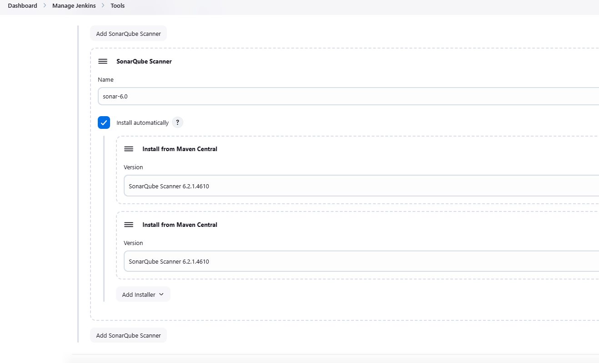

Generate Token in SonarQube server:

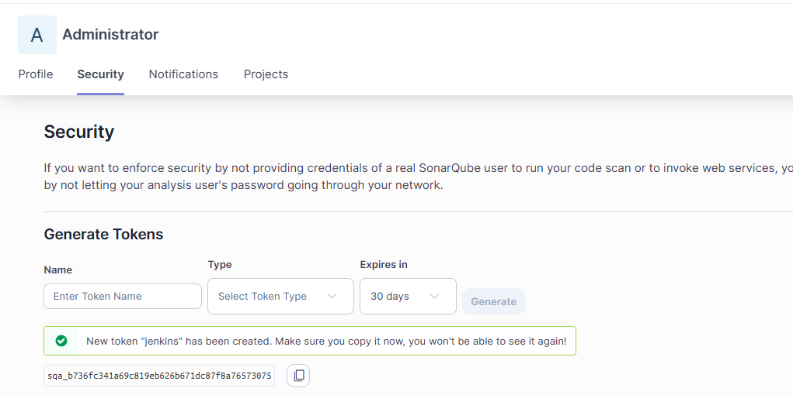


Configure sonarqube server in Jenkins server :

sonar-validate-token must be configured as secret text.

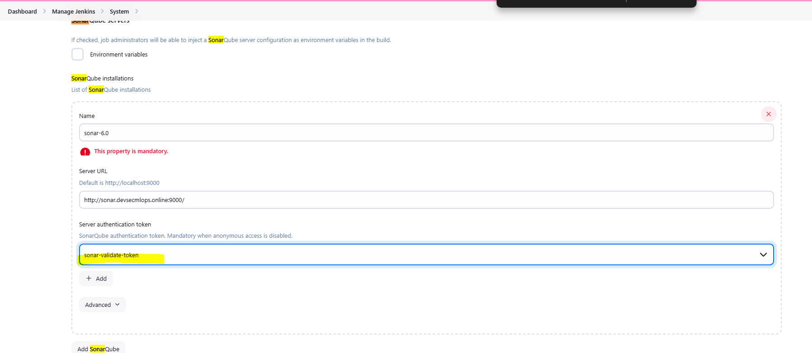

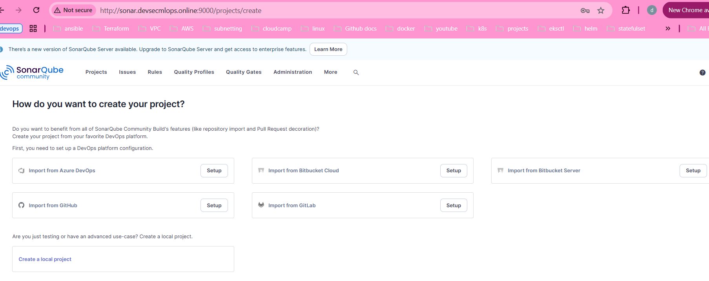


# Add SonarQube Analysis stage in jenkinsfile for backend service and Build and Deploy backend service through Jenkins


a new Quality Gate is created for the services for overall code and new code

issues -0, 0 bugs, secuity rating must be A, manintainability rating A, code coverage not less than 80%
code smells 0 vulnarabilities 0

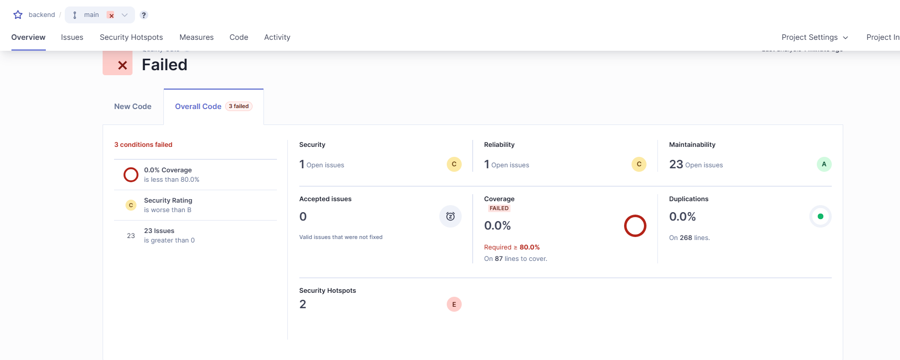

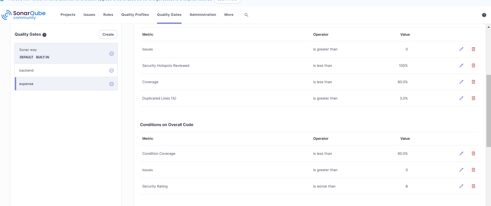

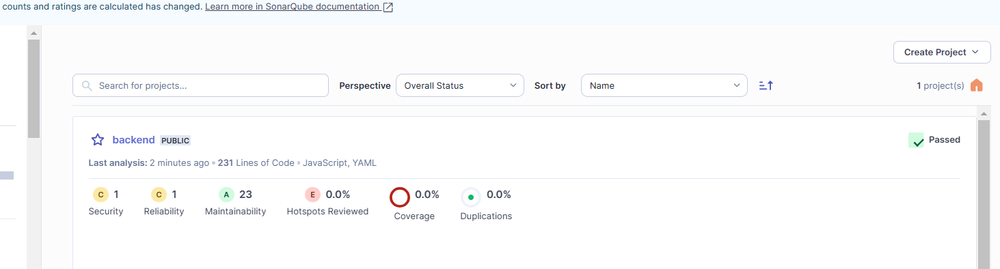

configure webhook at sonarqube server

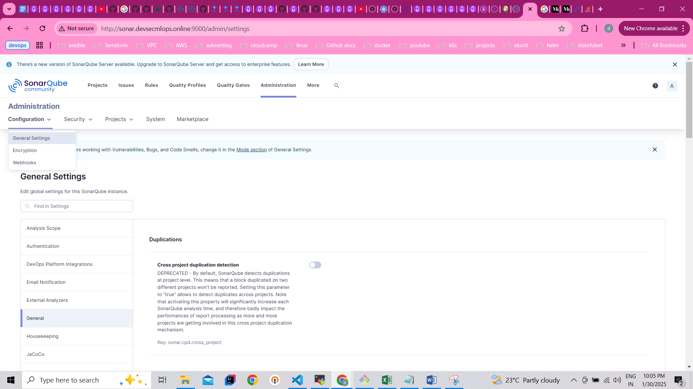

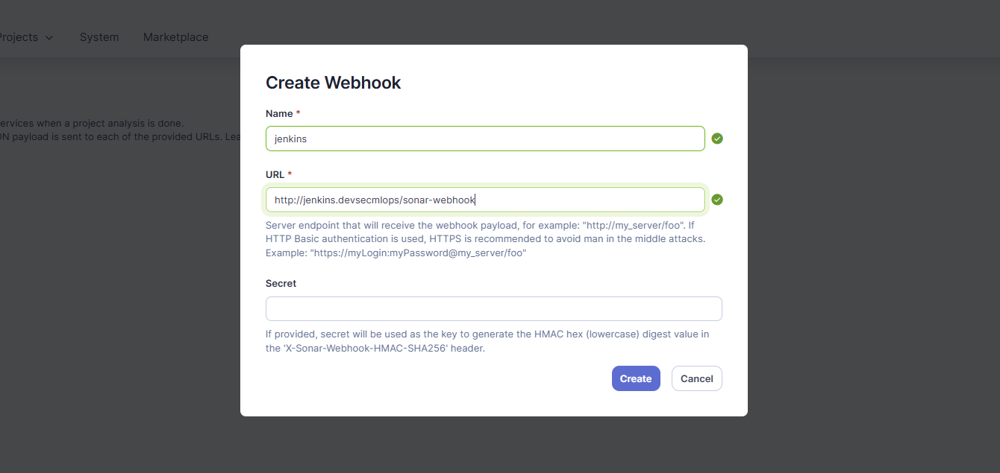

Ref: https://callmezydd.medium.com/unlocking-code-quality-integrating-jenkins-pipeline-with-sonarqube-and-github-7f450f1c90ab

# Created INFRA to deploy serivces on EKS cluster

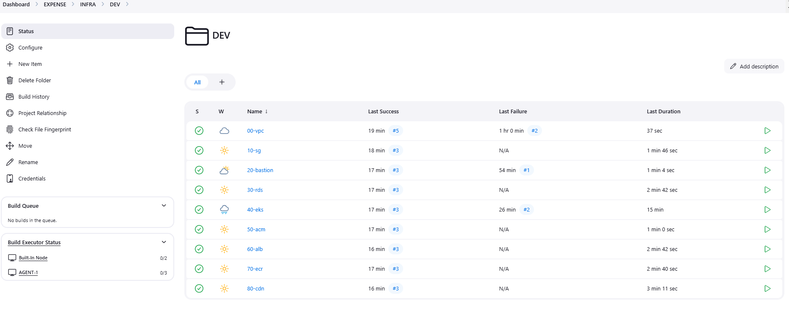


Quality profiles:

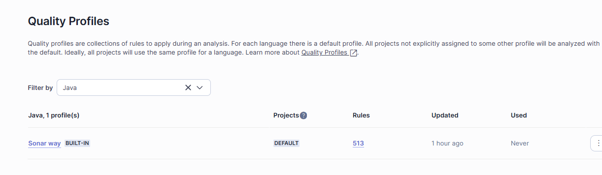

set of active rules for java languague given by Sonarqube.

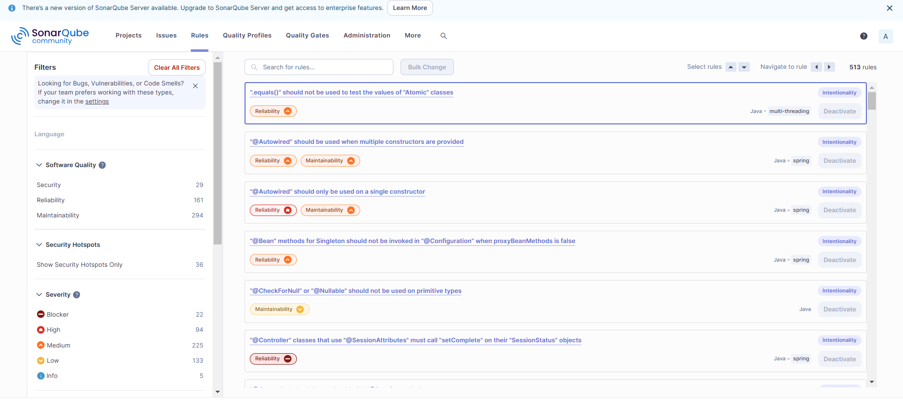


scanning (shift left)
-----------------

shifting the security scanning and testing in development before pushing the code to main branch. when developers
push code to feature branches, we should scan and run unit test cases

static source code analysis --> sonarqube

static applicaitoion security testing --> sonarqube

dynamic application security tsting --> veracode SAST (Static Application Security Testing) and DAST (Dynamic Application Security Testing)

open source library scan --> veracode

image scanning --> ECR scan

# SAST (Static Application Security Testing)

SAST is a white-box testing method that analyzes source code, bytecode, or binaries without executing the application to identify security vulnerabilities.

Key Characteristics:

Static: Examines the code itself, rather than running the application.
Early Detection: Can be performed during development, even before the code is compiled.
White-box: Requires access to the source code or compiled files.
Integration: Typically integrates into IDEs, CI/CD pipelines, or pre-commit hooks.

Identifies:

Code issues like SQL injection, XSS, insecure coding patterns, hardcoded secrets.
Vulnerabilities in logic, error handling, or access controls.
Violations of secure coding standards (e.g., OWASP Top 10, CWE).

Advantages:

Detects vulnerabilities early in the SDLC.
Helps enforce secure coding practices.
Offers detailed reports, pinpointing the exact location of the issue in the code.

Disadvantages:

False positives are common.
Cannot detect runtime issues or vulnerabilities related to deployment configuration.
Requires the source or compiled code to scan.
Examples of Tools:

Veracode (SAST feature)
SonarQube
Checkmarx
Fortify Static Code Analyzer

# DAST (Dynamic Application Security Testing)

DAST is a black-box testing method that tests an application while it is running to identify vulnerabilities in the live environment.

Key Characteristics:

Dynamic: Scans the application while it is executing.
Late-stage Testing: Usually performed after the application is deployed to a staging or test environment.
Black-box: Does not require access to the source code; it interacts with the application through its UI or APIs.
Identifies:

Runtime issues like SQL injection, XSS, authentication issues, and configuration vulnerabilities.
Problems with APIs, third-party integrations, or web servers.
Issues with session handling or insecure redirects.

Advantages:

Detects vulnerabilities in the live environment, including runtime configuration issues.
Simulates real-world attacks, showing how the application behaves under malicious scenarios.
Can uncover vulnerabilities missed by SAST (e.g., environment-specific issues).

Disadvantages:

Cannot pinpoint issues in the code (no visibility into the source code).
Limited in detecting logical vulnerabilities or issues that don’t manifest during runtime.
May require significant setup, like deploying a test environment or creating test accounts.
Examples of Tools:

OWASP ZAP (Zed Attack Proxy)
Burp Suite
Nessus
AppSpider

# sonarqube 

```
buildScript{
    repositories {
        mavenLocal()
        maven { url "$nexusUrl/content/groups/public/" }
    }
    dependentices {
        ..........
        classpath "org.sonarsource.scaaner.gradle:sonarqube-gradle-plugin:2.6.1"
        ...........
        .........

    }
}
apply plugin: 'org.sonarqube'

sonarQube {
    properties {
        property "sonqr.dynamicAnalysis", "reuseReports"
        property "sonar.clover.reportPath", "${Project.reporting.baseDir}/clover/clover.xml"
        property "sonar.coverage.exclusions", ['**/gensrc/**/*.java',
                                               '**/config/*.java....]
    }
}

```

```
systemProp.sonar.host.url = https://sonarqube.infra.devsecmlops.online
systemProp.sonar.jdbc.dirverClassName = com.mysql.jdbc.Driver
systemProp.sonar.dynamic=reuseReports
systemProp.sonar.jbdc.url=jdbc:mysql://maven.infra.devsecmlops.online:3306/sonar-db?useunicode=true&amp;charcterEncoding=utf8
systemProp.sonar.jdbc.username=sonar
systemProp.sonar.jdbc.password=sonar
```

```
plugins {
    id "org.springframework.boot" version "3.1.5"
    id "io.spring.dependency-management" version "1.0.11.RELEASE"
    id "java"
    id "jacoco"
    id "org.sonarqube" version "3.3"
}

group = "com.example"
version = "0.0.1-SNAPSHOT"
sourceCompatibility = "11"

repositories {
    mavenCentral()
}

dependencies {
    implementation "org.springframework.boot:spring-boot-starter"
    implementation "org.springframework.boot:spring-boot-starter-web"
    testImplementation "org.springframework.boot:spring-boot-starter-test"
}

test {
    useJUnitPlatform()
    finalizedBy jacocoTestReport // Generate Jacoco report after tests run
}

jacocoTestReport {
    dependsOn test // Tests are required to run before generating the report
    reports {
        xml.required = true
        html.required = true
    }
}

sonarqube {
    properties {
        property "sonar.projectKey", "your_project_key"
        property "sonar.host.url", "http://localhost:9000"
        property "sonar.login", "your_sonarqube_token"
        property "sonar.java.binaries", "${project.buildDir}/classes/java/main"
        property "sonar.sources", "src/main/java"
        property "sonar.tests", "src/test/java"
        property "sonar.junit.reportPaths", "${project.buildDir}/test-results/test"
        property "sonar.jacoco.reportPaths", "${project.buildDir}/jacoco/test.exec"
        property "sonar.coverage.exclusions", [
            '**/gensrc/**/*.java',
            '**/config/*.java'
        ]
    }
}
```


# Veracode SCA Report for spring boot micro service

To check security vulnerabilities using veracode SCA Agent in our local environment

we need to configure below steps in system and application to check security vulnerabilities using veracode SCA Agent 

1. create a folder with the name .veracode under user home directory (ex : C:\Users\username\.veracode for windows) and create file name credentails without any extension

2. after login to vercode platform <URL FOR VERACODE> , we will get veracode_api_key_id, veracode_api_key_secret from Api Credentials page

3. In the Veracode Platform, select Scans & Analysis > Software Composition Analysis.

Click the Agent-Based Scan tab.

Select a workspace.

Click Agents > Actions > Create > Gradle.

Click Create Agent & Generate Token.

Please use below link for reference
https://docs.veracode.com/r/t_sc_gradle

4. we need to add below changes to build.gradle file to add SCA Agent plug-in 

apply plugin: "com.srcclr.gradle"

 dependencies{
    ....
    classpath "gradle.plugin.com.srcclr:gradle:3.1.0"
 }

//below step is Optional if we set environment variable for export SRCCLR_API_TOKEN={apiToken}

  srcclr {     apiToken = {api_key}   } //which is  generated in Agent-Based Scan tab

```
./gradlew clean build srcclr  will give you secuity vulnerabilities list in tabular form

```

while running the above command if you get "PKIX path building failed" and "unable to find valid certification path to requested target", 

 import the veracode cer file into cacerts in command line and rerun the above command.

This is a Veracode Software Composition Analysis (SCA) report output for a Gradle-based project, identifying open-source dependencies and vulnerabilities.

> Task :srcclrEvidence
[srcclr] Generated dependency graphs for 2 modules
[srcclr] Created 305 pieces of evidence

> Task :srcclr
[srcclr] Performing vulnerable methods scan at C:\Users\sputcha\IdeaProjects\security-service-veracode


```
Summary Report
Scan ID                                   c8b2fc07-9a18-4bcf-a1d4-9a4cb8599462
Scan Date & Time                          May 30 2023 11:27PM IST
Account type                              ENTERPRISE
Scan engine                               3.1.0 (latest Unknown)
Analysis time                             19 seconds
User                                      sputcha
Project                                   C:\Users\sputcha\IdeaProjects\security-service-veracode
Package Manager(s)

Open-Source Libraries
Total Libraries                           290
Direct Libraries                          4
Transitive Libraries                      290
Vulnerable Libraries                      30
Third Party Code                          98.4%

Security
With Vulnerable Methods                   0
High Risk Vulnerabilities                 21
Medium Risk Vulnerabilities               43
Low Risk Vulnerabilities                  3

Vulnerabilities - Public Data

CVE-2021-22047                            High Risk       Security Restriction Bypass               spring-boot-actuator 2.2.6.RELEASE
CVE-2022-1471                             High Risk       Remote Code Execution (RCE)               SnakeYAML 1.26
CVE-2022-22963                            High Risk       Remote Code Execution                     spring-cloud-function-context 3.0.3.RELEASE
CVE-2021-22044                            High Risk       Involuntary Endpoint Exposure             Spring Cloud OpenFeign Core 2.2.2.RELEASE
CVE-2023-1436                             High Risk       Denial Of Service (DoS)                   Jettison 1.3.7
CVE-2022-40150                            High Risk       Denial Of Service (DoS)                   Jettison 1.3.7
CVE-2021-37136                            High Risk       Denial Of Service(DoS)                    Netty/Codec 4.1.48.Final
CVE-2021-39154                            High Risk       Remote Code Execution (RCE)               XStream Core 1.4.17
CVE-2021-39148                            High Risk       Remote Code Execution (RCE)               XStream Core 1.4.17
CVE-2021-39139                            High Risk       Remote Code Execution (RCE)               XStream Core 1.4.17
CVE-2021-39141                            High Risk       Remote Code Execution (RCE)               XStream Core 1.4.17
CVE-2021-39146                            High Risk       Remote Code Execution (RCE)               XStream Core 1.4.17
CVE-2021-39144                            High Risk       Remote Code Execution (RCE)               XStream Core 1.4.17
CVE-2021-39149                            High Risk       Remote Code Execution (RCE)               XStream Core 1.4.17
CVE-2021-39151                            High Risk       Remote Code Execution (RCE)               XStream Core 1.4.17
CVE-2021-39153                            High Risk       Remote Code Execution (RCE)               XStream Core 1.4.17
CVE-2021-39150                            High Risk       Remote Code Execution (RCE)               XStream Core 1.4.17
CVE-2021-39152                            High Risk       Server-Side Forgery Request               XStream Core 1.4.17
CVE-2021-39147                            High Risk       Remote Code Execution (RCE)               XStream Core 1.4.17
CVE-2023-28709                            High Risk       Denial Of Service (DoS)                   tomcat-embed-core 9.0.43
CVE-2022-23181                            High Risk       Time Of Check To Time Of Use (TOCTOU)     tomcat-embed-core 9.0.43
CVE-2022-25857                            Medium Risk     Denial Of Service (DoS)                   SnakeYAML 1.26
CVE-2022-38750                            Medium Risk     Denial Of Service (DoS)                   SnakeYAML 1.26
CVE-2022-38749                            Medium Risk     Denial Of Service (DoS)                   SnakeYAML 1.26
CVE-2022-38751                            Medium Risk     Denial Of Service (DoS)                   SnakeYAML 1.26
CVE-2022-38752                            Medium Risk     Denial Of Service (DoS)                   SnakeYAML 1.26
CVE-2021-42550                            Medium Risk     Remote Code Execution (RCE)               Logback Core Module 1.2.3
```
Ref: https://docs.veracode.com/r/t_sc_gradle